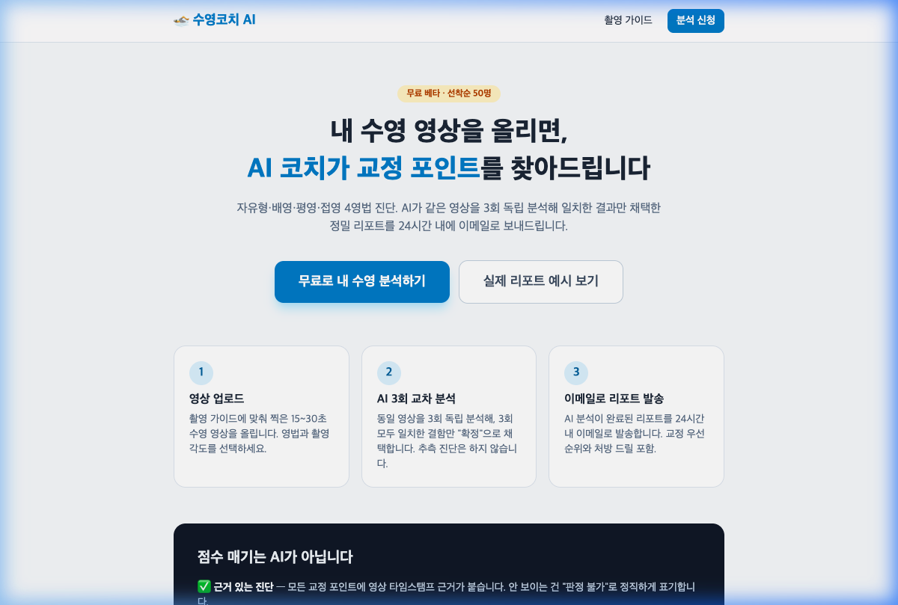

# 🏊‍♂️ 수영코치 AI (SwimCoach AI)

> **🚀 실제 서비스 데모 웹앱 바로가기**: **[수영코치 AI 무료 베타 테스트 참여](https://swim-coach.example.com)**  
> *(선착순 50명 한정 무료 운영 중)*

---



## 💡 "내 수영 영상을 올리면, AI 코치가 교정 포인트를 찾아드립니다"

수영 영상을 올리면 AI가 동일 영상을 3회 독립 분석하여 일치한 결과만 채택하고, 정밀 분석된 코칭 리포트를 24시간 내에 이메일로 발송해 드립니다.

단순히 상투적인 점수를 매기는 시스템이 아닙니다. **모든 교정 포인트에 영상 타임스탬프 근거**가 붙으며, 화면상으로 판정할 수 없는 항목은 **"판정 불가"로 정직하게 표기**합니다. 결함 나열에 그치지 않고, 무엇부터 고쳐야 다른 문제가 함께 풀리는지 **교정 우선순위와 그에 맞는 훈련 드릴**을 처방해 드립니다.

---

## 🌟 핵심 신뢰 포인트 (Core Philosophy)

1. **점수 매기는 AI가 아닙니다**  
   정량 측정값을 인위적으로 지어내지 않고, 관찰 기반의 철저한 정성적 분석을 지향합니다.
2. **근거 있는 진단 (타임스탬프 연동)**  
   모든 피드백에는 리포트 내에 시각 증거(타임스탬프 또는 키프레임 번호)가 명시되어 사용자가 직접 영상에서 매칭할 수 있습니다.
3. **일치한 결과만 채택 (3회 교차 분석)**  
   동일한 분석 요청을 독립된 3회 병렬 분석으로 실행하여, 3회 모두에서 교차 검증된 결함만 확정 채택합니다.
4. **각도 상보 검증 및 게이팅**  
   측면 영상은 글라이드와 하체 처짐 등에, 정면/후면은 좌우 대칭과 크로스오버에 강점을 지닙니다. 촬영된 각도에 적합한 스키마 항목만 판정하고 맞지 않는 각도의 항목은 자동으로 판정 보류합니다.

---

## 🛠 아키텍처 및 시스템 흐름

```
[React SPA] 수영 영상 및 정보 접수 폼 → POST /api/submit
                                ↓
[FastAPI]   접수 데이터 수신 → 백그라운드 태스크 기동 (Gemini API 3회 병렬 분석 실행)
                                ↓
[FastAPI]   분석 결과 집계 및 다수결 기반 리포트 초안 생성 → 발송 대기열 등록
                                ↓
[운영자/관리자] 발송 대기열(/admin)에서 생성된 리포트 최종 승인 → 사용자에게 이메일로 HTML 리포트 발송
```

### 디렉토리 구성
* **`server.py`**: FastAPI 백엔드 (업로드 처리, 시간당 IP당 어뷰징 방지 레이트 리미트, 발송 대기열 API 및 어드민 페이지 제공)
* **`report_render.py`**: 분석 결과 JSON 데이터를 수려한 HTML/Markdown 리포트로 렌더링
* **`swim-web/`**: 클로드 코드로 구축한 직관적이고 미려한 UI 프론트엔드 (Vite + React + TypeScript + Tailwind CSS)

---

## ⚙️ 실행 방법 및 설정

> ⚠️ **중요 (비공개 자산에 대한 안내)**
> 수영 코칭의 핵심 프롬프트 원문 및 영법별 스키마 JSON(`private_assets/` 폴더 하위)은 비공개 자산이므로 공개 저장소에서 제외되어 있습니다. 
> 로컬 실행 시 `SWIM_ASSETS_DIR` 환경변수로 스키마 파일들이 포함된 경로를 제공해야 정상 작동합니다.

### 1) 의존성 설치
```bash
# 백엔드 의존성 설치 (+ 시스템에 ffmpeg 설치가 필요합니다)
pip install -r requirements.txt

# 프론트엔드 빌드
npm install --prefix swim-web
npm run build --prefix swim-web
```

### 2) 환경 변수 (.env) 설정
프로젝트 루트에 `.env` 파일을 생성하고 아래 항목들을 정의합니다:
```env
GEMINI_API_KEY=your_gemini_api_key   # Gemini API 키 (코드 하드코딩 금지)
ADMIN_TOKEN=your_admin_secret_token  # /admin 발송 대기열 페이지 접근 비밀 토큰
SWIM_ASSETS_DIR=./private_assets     # 프롬프트 MD 파일 및 스키마 경로
MAX_UPLOAD_MB=50                     # 최대 비디오 업로드 용량
FREE_CREDITS=1                       # 이메일당 무료 제공 횟수
RATE_LIMIT_PER_HOUR=10               # IP당 시간당 최대 분석 요청 횟수
```

### 3) 로컬 서버 구동
```bash
python3 -m uvicorn server:app --host <HOST> --port 8010
```

---

## 🤝 기여 (Contributing)

수영 코칭의 대중화를 함께 만들어갈 개발자들의 기여를 적극 환영합니다! 
* 촬영 가이드 UI 개선 및 리포트 시각화 디자인 고도화
* 다국어 지원 및 스토리지 백엔드 (GCS, AWS S3 등) 연동 추가
* 버그 제보 및 기능 개선은 깃허브 Issue로 먼저 제안해 주세요.

---

## 📝 라이선스 및 강력 법적 경고 (License & Legal Disclaimer)

이 프로젝트는 [MIT](LICENSE) 라이선스를 따릅니다.

> 🚨 **법적 이중 방어벽 (강력 경고)**
> * 본 코드를 포크(Fork)하거나 수정하여 타인을 무단 촬영하는 카피캣 서비스를 구축할 경우 발생하는 초상권 침해, 성폭력처벌법 등 모든 민형사상 법적 책임은 해당 행위를 한 당사자 본인에게 있습니다.
> * 이 프로젝트는 본인 또는 촬영에 동의한 대상의 정상적인 수영 자세 피드백 및 자세 교정 목적으로만 사용해야 합니다.
